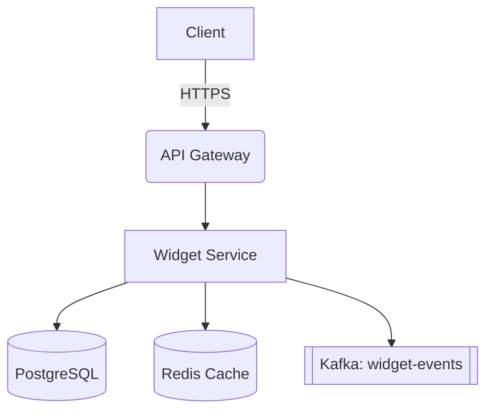

# Widget Service

> A dummy service used to test documentation rendering in Backstage TechDocs.

## Overview

The **Widget Service** is a fictional microservice that generates, stores, and serves widgets on demand. This document exists purely to exercise common Markdown features so you can verify your Backstage TechDocs pipeline (MkDocs + Material theme) is rendering correctly.

- Owns the `widgets` and `widget-events` Kafka topics
- Exposes a REST API and a gRPC API
- Backed by PostgreSQL and Redis

## Table of Contents

1. [Architecture](#architecture)
2. [Getting Started](#getting-started)
3. [API Reference](#api-reference)
4. [Configuration](#configuration)
5. [FAQ](#faq)

---

## Architecture



The service follows a standard three-tier architecture:

| Layer         | Technology     | Purpose                          |
|---------------|----------------|-----------------------------------|
| API           | Go / gRPC-Gateway | Request handling & validation  |
| Business Logic| Go              | Widget lifecycle management      |
| Storage       | PostgreSQL 15   | Durable widget records           |
| Cache         | Redis 7         | Hot widget lookups                |

## Getting Started

### Prerequisites

- Go 1.22+
- Docker & Docker Compose
- `make`

### Local Setup

Clone the repo and spin up dependencies:

```bash
git clone https://github.com/example/widget-service.git
cd widget-service
docker compose up -d postgres redis
make run
```

Once running, the service listens on `localhost:8080`.

!!! note "Admonition test"
    This is a MkDocs Material-style admonition. If your Backstage theme
    supports it, this box should render with a colored border and icon.

!!! warning "Heads up"
    This is a **warning** admonition — useful for testing whether custom
    styling is picked up correctly.

### Verify it's working

```bash
curl -s http://localhost:8080/healthz
```

Expected response:

```json
{
  "status": "ok",
  "version": "1.4.2",
  "uptime_seconds": 42
}
```

## API Reference

### `GET /widgets/{id}`

Fetches a single widget by ID.

**Response**

```json
{
  "id": "wdg_01H8Z",
  "name": "Deluxe Sprocket",
  "color": "blue",
  "weight_grams": 120,
  "created_at": "2026-01-15T10:00:00Z"
}
```

### `POST /widgets`

Creates a new widget.

| Field       | Type   | Required | Description            |
|-------------|--------|----------|-------------------------|
| `name`      | string | yes      | Display name            |
| `color`     | string | no       | Hex or named color      |
| `weight_grams` | int | no       | Weight in grams          |

### `DELETE /widgets/{id}`

Deletes a widget. Returns `204 No Content` on success.

## Configuration

Configuration is provided via environment variables:

```yaml
# config.yaml
server:
  port: 8080
  timeout: 30s

database:
  host: localhost
  port: 5432
  name: widgets_db

cache:
  host: localhost
  port: 6379
  ttl: 300
```

- [ ] TLS termination handled by ingress
- [x] Health checks configured
- [x] Metrics exported to Prometheus
- [ ] Rate limiting enabled

## FAQ

<details>
<summary>Why is it called "Widget Service"?</summary>

No particular reason — it's a placeholder name used across internal
demos and documentation examples.

</details>

<details>
<summary>Is this a real service?</summary>

No. This entire document is dummy content generated to test Markdown
rendering (tables, code blocks, admonitions, diagrams, collapsibles)
inside a Backstage TechDocs setup.

</details>

---

**Related links:**

- [Backstage TechDocs docs](https://backstage.io/docs/features/techdocs/techdocs-overview)
- [MkDocs Material](https://squidfunk.github.io/mkdocs-material/)

*Last updated: 2026-08-29*
